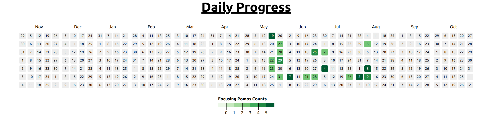

# Notion Heatmap

Generate github-like heatmaps based on the notion database, deployed in vercel



Public link: [click here](https://notion-heatmap.vercel.app/)

## Prepare First

Environment Variables
- NOTION_TOKEN
- NOTION_DATABASE_ID

Save the above variables in a `.env` file to run locally.

Also, set them in vercel's 'project settings'/'environment variables'.

## Run Locally

```
node index.js
```

## Publish using [Vercel](https://vercel.com/)

balala todo

---

notion api reference: [click here](https://developers.notion.com/reference/intro)

缺点：
- last_edited_time 会被更新